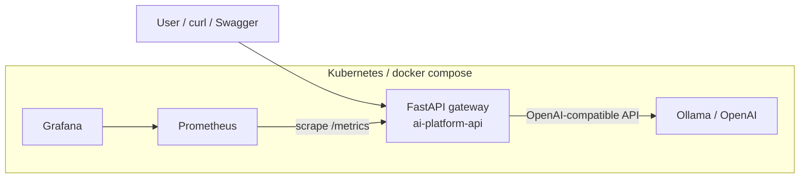

# AI Platform Starter

A miniature "internal AI platform" — a gateway to language models with a full DevOps
backing: Docker, Kubernetes, CI/CD on GitHub Actions and Prometheus + Grafana
monitoring.

Built as a portfolio project for **Junior DevOps / Cloud / AI** roles, deliberately
covering every point of a typical job posting: Linux, Docker, Kubernetes, Git, CI/CD,
monitoring and LLM integration (OpenAI-compatible API / Ollama).

## What the application does

A FastAPI service exposing a small API:

| Endpoint | Description |
|---|---|
| `POST /api/chat` | Forwards a prompt to the LLM backend (Ollama, OpenAI or any OpenAI-compatible API) and returns the answer with its execution time |
| `GET /healthz` | Kubernetes liveness probe |
| `GET /readyz` | Kubernetes readiness probe |
| `GET /metrics` | Prometheus metrics (RPS, LLM p95 latency, error count) |
| `GET /docs` | Interactive Swagger documentation (generated by FastAPI) |

Setting `LLM_MOCK=true` returns synthetic answers with no model at all, so the whole
thing runs in CI and on a GPU-less cluster.

## Architecture



CI/CD: push to GitHub → GitHub Actions runs **ruff** (lint), **pytest** (tests) and
**kustomize** manifest validation, then builds the Docker image and (on `main`)
publishes it to the **GitHub Container Registry (ghcr.io)**.

## Quick start

### 1. Locally, without Docker (mock mode — zero dependencies)

```bash
git clone https://github.com/mcjkrok/ai-platform-starter.git
cd ai-platform-starter
python -m venv .venv && source .venv/bin/activate
make install
make run-mock
# in a second terminal:
curl -X POST localhost:8000/api/chat -H 'Content-Type: application/json' \
     -d '{"prompt": "Hello!"}'
```

### 2. Full stack via docker compose (API + Ollama + Prometheus + Grafana)

```bash
make compose-up
docker compose exec ollama ollama pull llama3.2:1b   # once, ~1.3 GB
curl -X POST localhost:8000/api/chat -H 'Content-Type: application/json' \
     -d '{"prompt": "Explain what Kubernetes is in 2 sentences"}'
```

- API + Swagger: http://localhost:8000/docs
- Prometheus: http://localhost:9090
- Grafana (dashboard "AI Platform Starter"): http://localhost:3000 (admin/admin)

To skip downloading a model: `LLM_MOCK=true make compose-up`.

### 3. Kubernetes (k3d / minikube / kind)

```bash
# k3d example
k3d cluster create ai-platform
docker build -t ai-platform-starter:local .
k3d image import ai-platform-starter:local -c ai-platform

kubectl create namespace ai-platform-dev
kubectl apply -k k8s/overlays/dev
kubectl -n ai-platform-dev port-forward svc/ai-platform-api 8000:80
```

The `dev` overlay enables mock mode (no Ollama needed on the cluster); the `prod`
overlay scales the deployment to 2 replicas. The kustomize layout (base + overlays)
is ready to be wired into **ArgoCD** as a GitOps application.

## Project layout

```
ai-platform-starter/
├── app/                    # application code (FastAPI)
│   ├── main.py             # endpoints, Prometheus metrics
│   ├── llm_client.py       # OpenAI-compatible API client + mock variant
│   └── config.py           # configuration via environment variables
├── tests/                  # pytest suite (LLM mocked via dependency injection)
├── Dockerfile              # multi-stage build, non-root user, healthcheck
├── docker-compose.yml      # API + Ollama + Prometheus + Grafana
├── k8s/
│   ├── base/               # Deployment, Service, ConfigMap, HPA
│   └── overlays/           # dev (mock) and prod (2 replicas) — kustomize
├── monitoring/             # Prometheus config + Grafana dashboard
├── .github/workflows/ci.yml  # CI/CD pipeline (GitHub Actions)
└── Makefile                # shortcuts: run, test, lint, compose-up, k8s-dev...
```

## Key design decisions

- **OpenAI-compatible API instead of a vendor SDK** — one client covers Ollama
  (local, free), OpenAI and Azure OpenAI. Switching backends is an environment
  variable, not a code change.
- **Mock mode** — the platform tests itself in CI and the demo runs anywhere, with
  no GPU and no API keys.
- **Liveness vs readiness** — separate `/healthz` and `/readyz` endpoints, because
  Kubernetes uses them for different decisions (restarting a pod vs routing traffic).
- **Multi-stage Dockerfile + non-root user** — a smaller image and the basics of
  container security.
- **Kustomize base/overlays** — the same manifests for dev and prod with the
  differences expressed as patches; the standard layout for GitOps/ArgoCD.
- **Low-cardinality metrics** — the `path` label uses the route template
  (`/api/chat`) rather than the raw URL, so Prometheus does not blow up.
- **Image published only from `main`** — pull requests build the image for
  validation but do not publish; `latest` + commit SHA tags allow rollbacks.

## Roadmap

- [ ] ArgoCD — automatic overlay synchronisation from the repo (GitOps)
- [ ] Cloud deployment: Azure AKS or AWS EKS (free tier)
- [ ] Streaming LLM responses (Server-Sent Events)
- [ ] Rate limiting and simple token authorisation
- [ ] Prometheus alerts (Alertmanager) on rising 5xx error rates

## Stack

Python 3.12 · FastAPI · httpx · pytest · ruff · Docker · docker compose ·
Kubernetes (kustomize, HPA, probes) · GitHub Actions · ghcr.io · Prometheus · Grafana ·
Ollama / OpenAI API
